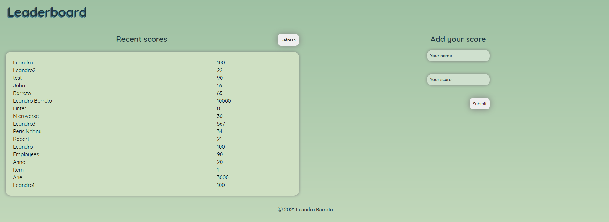
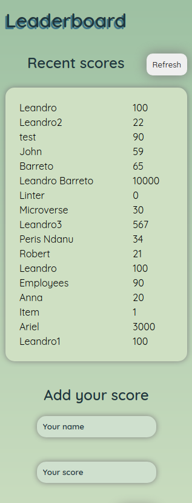

# Project Name

> Leaderboard website that displays scores submitted by different players.

Allows you to submit your score and all data is preserved thanks to the external Leaderboard API service.

## Built With

- HTML5, CSS3, JavaScript
- Webpack
- ES6 Syntax

## Live Demo

[Live Demo Link](https://leandro-barretoo.github.io/leaderboard_api/)

## Getting Started

To get a local copy up and running follow these simple example steps.

### Setup

- Clone the repo `git clone git@github.com:Leandro-Barretoo/ToDo_Redo.git`
- `cd` into the directory
- run `npm i` or `npm install` to download required node_modules
- checkout to the desired branch `git chechout`
- open in your desired code editor
- run `npm start` to start live server

## Author

👤 **Leandro Barreto**

- GitHub: [@Leandro-Barretoo](https://github.com/Leandro-Barretoo)
- LinkedIn: [Leandro Barreto](https://www.linkedin.com/in/leandroobarreto/)

## 🤝 Contributing

Contributions, issues, and feature requests are welcome!

Feel free to check the [issues page](../../issues/).

## Show your support

Give a ⭐️ if you like this project!

## Acknowledgments

- Hat tip to anyone whose code was used
- Inspiration
- etc

## 📝 License

This project is [MIT](./MIT.md) licensed.
